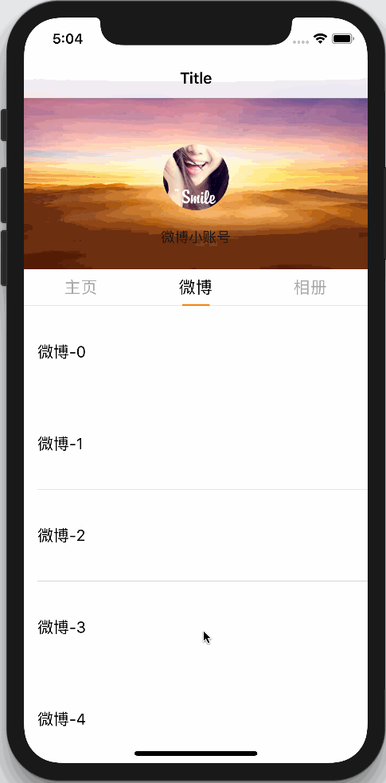

# weibo-UserCenter

[]()
[]()
[]()
[]()


仿新浪微博个人中心页面的滑动效果


## 环境要求

- iOS9.0+
- Swift4.0
- Xcode9.0+

## UI层级结构

```
UserCenterViewController.view
│
└── UserCenterScrollView
	│
	├── UserCenterHeaderView
	│
	├── UserCenterSegmentedView
	│
	└── UIPageViewController.view
		│
		├── HomeViewController.view
		│	│
		│	└── UITableView
		│
		├── WeiboListViewController.view
		│	│
		│	└── UITableView
		│
		└── AlbumViewController.view
			│
			└── UICollectionView
```

如果需要集成下拉刷新和上拉加载更多的功能，可以在`UserCenterScrollView`中集成下拉刷新，然后分别在`HomeViewController`、`WeiboListViewController`、`AlbumViewController`控制器中的UITableView/UICollectionView中分别集成上拉刷新功能。


## 使用说明

- 将`UserCenter`文件夹拖到你的项目
- 新建控制器并继承自`UserCenterContentProxyViewController`
	- 一共需要分四步走，相关用法可以参考`HomeViewController`、`WeiboListViewController`、`AlbumViewController`
		1. 需要继承自`UserCenterContentProxyViewController`
			``` Swift
			class YourViewController: UserCenterContentProxyViewController { ... }
			```
		2. 需要设置滚动视图的contentInset属性，修正内容偏移量
			``` Swift
			tableView.contentInset = defaultScrollContentInsets(for: .navigationBar)
			```
		3. 重写父类的方法，目前只需重写`scrollToTop()`方法即可
			``` Swift
			override func scrollToTop() {
				tableView.setContentOffset(.zero, animated: false)
			}
			```
		4. 如果子类重写了`UIScrollViewDelegate`中的`scrollViewDidScroll(_:)`方法，记得调用父类的方法
			``` Swift
			override func scrollViewDidScroll(_ scrollView: UIScrollView) {
				super.scrollViewDidScroll(scrollView)
				...
			}
			```
- 修改`UserCenterViewController`类的`viewControllers`属性，返回你自己的控制器


## 演示

[]()

## 协议

`weibo-UserCenter`被许可在 MIT 协议下使用。查阅`LICENSE`文件来获得更多信息。
